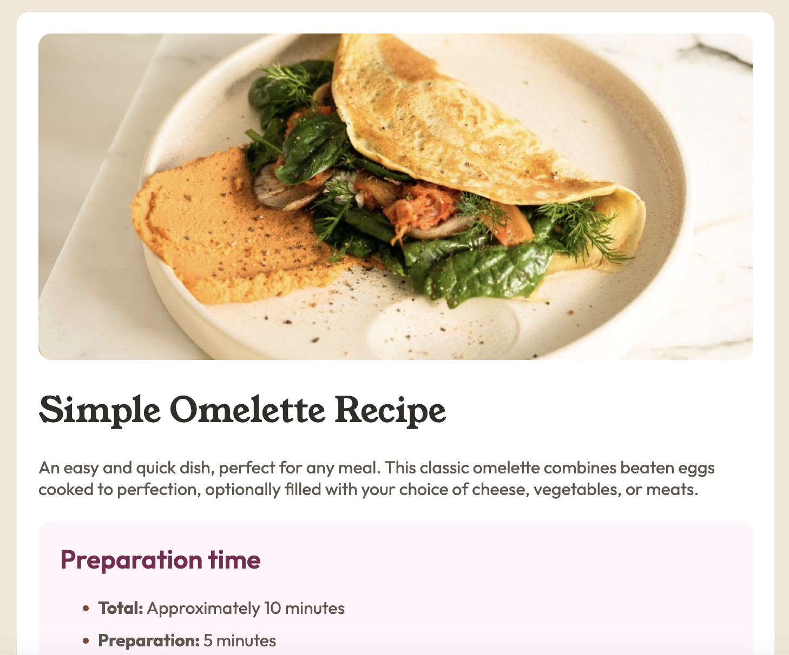

Currently finetuning this project!!

# Frontend Mentor - Recipe page solution

This is a solution to the [Recipe page challenge on Frontend Mentor](https://www.frontendmentor.io/challenges/recipe-page-KiTsR8QQKm). Frontend Mentor challenges help you improve your coding skills by building realistic projects. 

## Table of contents

- [Overview](#overview)
  - [The challenge](#the-challenge)
  - [Screenshot](#screenshot)
  - [Links](#links)
- [My process](#my-process)
  - [Built with](#built-with)
  - [What I learned](#what-i-learned)
  - [Continued development](#continued-development)
- [Author](#author)

## Overview

### Screenshot

### Links

- Solution URL: [GitHub](https://github.com/lozukka/recipe-page-main)
- Live Site URL: [Live site URL](https://lozukka.github.io/recipe-page-main/)

## My process

### Built with

- Semantic HTML5 markup
- CSS custom properties
- Flexbox
- Mobile-first workflow

### What I learned

I have had a little break with coding. This was sort-of refreshner and I tried to remember again how to do things. 
I started with the HTML and them made the CSS. I am not sure how to make the Nutrision-part. I went with a table, but I couldn't make the border visible. It can be a browser issue. Also I have trouble with the listmarkers. There should be more space between markers and text. 

### Continued development

I will try work with the table and the listmarkers in the future. 

## Author

- Frontend Mentor - [@lozukka](https://www.frontendmentor.io/profile/lozukka)
